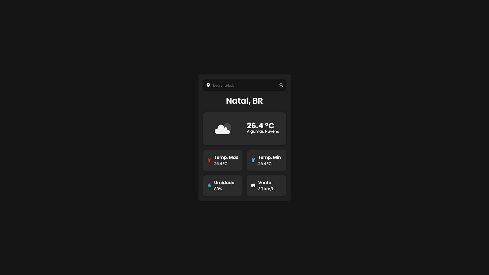

# Weather App

Aplicação simples de clima que consome a API da OpenWeather para exibir informações como temperatura, cidade e condições do tempo.

## Tecnologias utilizadas

* HTML
* CSS
* JavaScript
* API da OpenWeather


## Funcionalidades

* Buscar clima por cidade
* Exibir temperatura atual
* Mostrar descrição do clima


## Preview

### Tela inicial


### Resultado da busca


## Como usar

Para utilizar o projeto, você precisa de uma API Key da OpenWeather.

### 1. Criar conta

Acesse o site da OpenWeather e crie uma conta gratuita.

### 2. Gerar API Key

Após criar a conta:

* Vá até o painel de usuário
* Gere uma nova API Key

### 3. Configurar no projeto

No arquivo JavaScript, procure pela variável:

```js
const apiKey = "API_KEY_AQUI";
```

Substitua pelo valor da sua chave.


### 4. Executar o projeto

Basta abrir o arquivo `index.html` no navegador.

## Observações

* A API Key não está incluída por motivos de segurança
* Pode haver limite de requisições na versão gratuita da API

---


